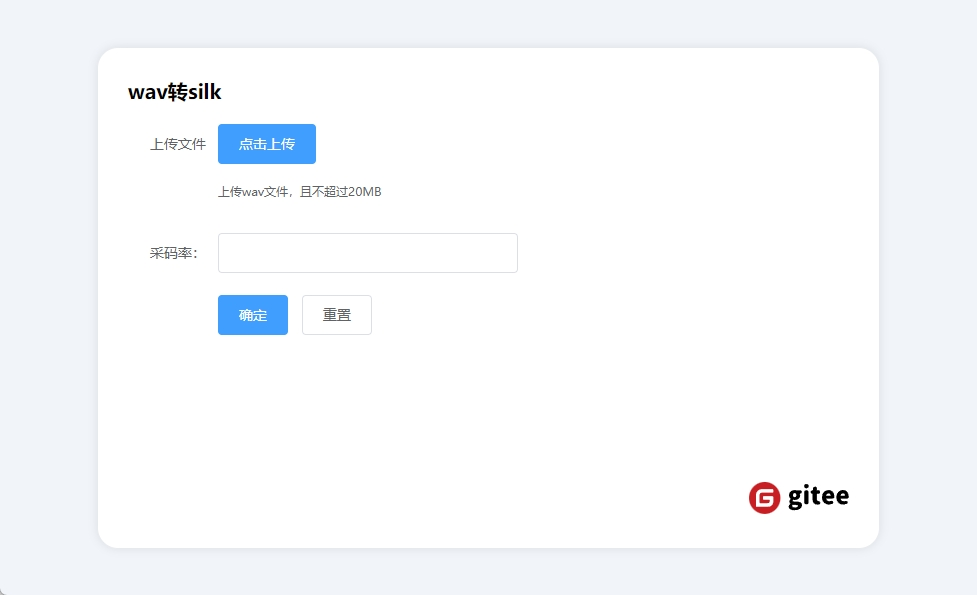
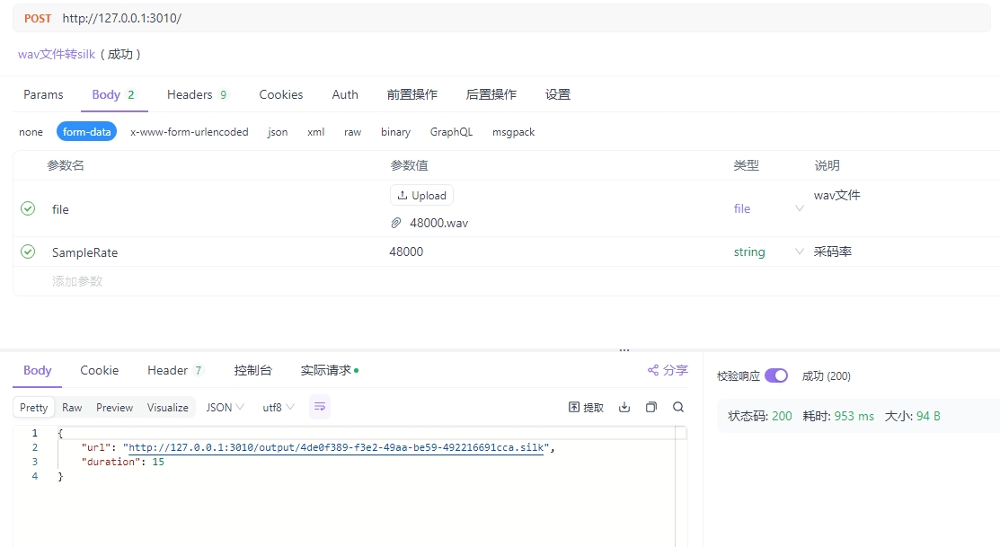

# .wav转.silk([silk-wasm](https://github.com/idranme/silk-wasm)的http服务)

上传wav或者pcm音频文件，返回为silk格式

## 示例


## post接口



## [文档地址](https://apifox.com/apidoc/shared-bd2a5264-63f7-484e-861d-c60c1890f6e9)

## 核心库
- [silk-wasm](https://github.com/idranme/silk-wasm)

## 部署
- 用pnpm 安装依赖 

```npm
pnpm install
```

- 启动命令 

```npm
npm run serve
```
- 指定端口启动
```npm
$env:PORT = 4000; npm run serve
```

## 访问
```url
http://localhost:3010 
```
